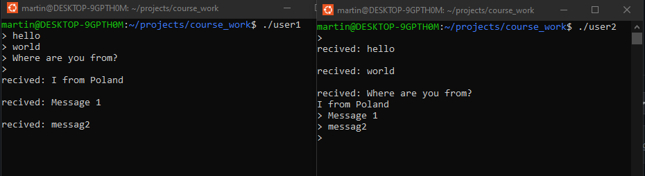

# OS_course_work
Курсовая работа по "операционным системам"

<strong>Программа поддержки простого протокола связи между двумя процессами.</strong> 
Процессы организуют взаимодействие между собой для обмена данными. 
Данные представляют собой посследовательность блоков фиксированной длины. 
Тип связи - дуплексный. Обмен данным поддерживается через общую память.

--------

Пример готовой работы:  
